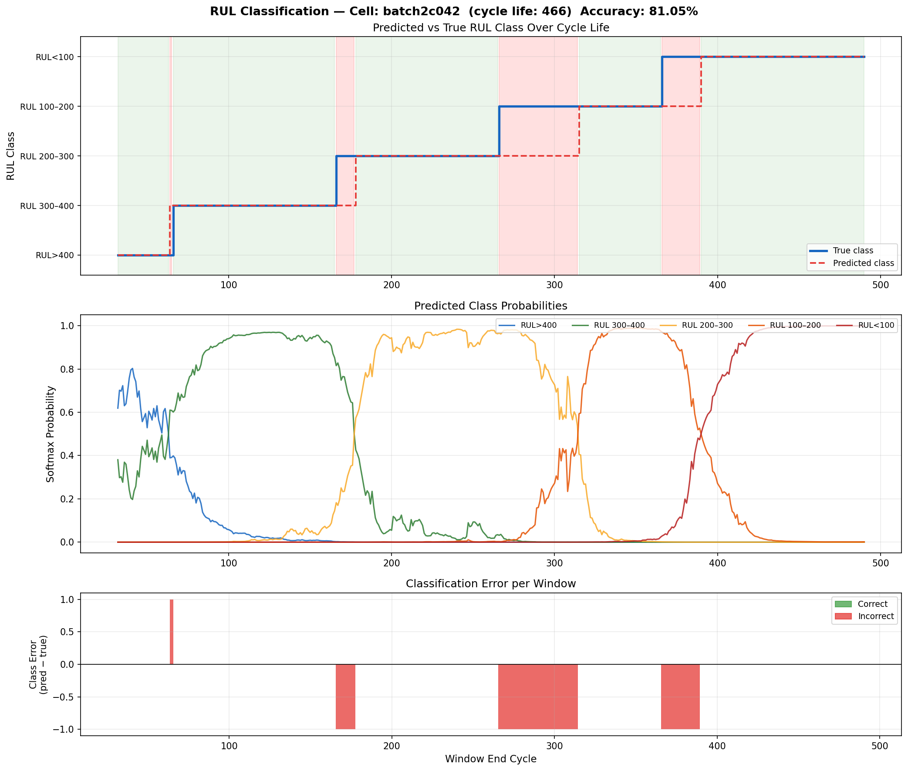
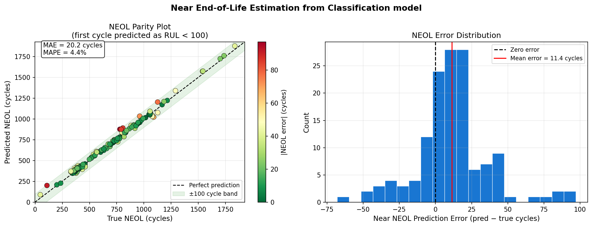
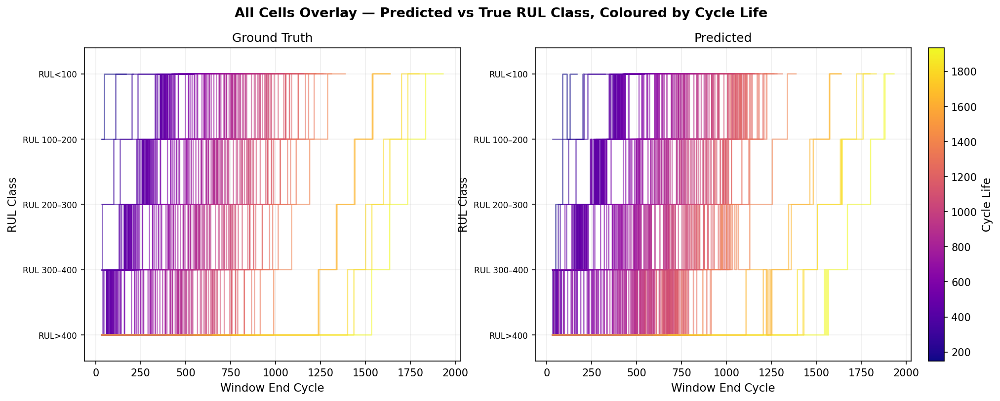

# Battery RUL Classification with CNN+GRU

Sliding-window RUL (Remaining Useful Life) classification of lithium-ion batteries using the MIT-Stanford dataset. A CNN+GRU model classifies each window of cycles into one of 5 RUL classes.

## RUL class boundaries

| Class | Condition | Meaning |
|-------|-----------|---------|
| 0 | RUL > 400 | Early life |
| 1 | 300 < RUL ≤ 400 | Mid-early life |
| 2 | 200 < RUL ≤ 300 | Mid life |
| 3 | 100 < RUL ≤ 200 | Late life |
| 4 | RUL ≤ 100 | Near end of life |


---

## Table of Contents
- [Results](#results)
- [Dataset](#dataset)
- [Usage](#usage)
- [Model Architecture](#model-architecture)
- [Feature Engineering](#feature-engineering)
- [File Structure](#file-structure)

---

## Results

**Test Accuracy: 79.72%** | Test Loss: 0.8454

| Class | Precision | Recall | F1 | Support |
|-------|-----------|--------|----|---------|
| RUL > 400 | 0.92 | 0.85 | 0.89 | 2627 |
| RUL 300–400 | 0.77 | 0.69 | 0.73 | 2697 |
| RUL 200–300 | 0.67 | 0.79 | 0.73 | 2700 |
| RUL 100–200 | 0.78 | 0.73 | 0.75 | 2700 |
| RUL < 100 | 0.86 | 0.93 | 0.89 | 2760 |
| **Weighted avg** | **0.80** | **0.80** | **0.80** | **13484** |

**Confusion Matrix:**
```
              RUL>400  RUL>300  RUL>200  RUL>100  RUL<100
RUL>400        2237      316      73        0        1
RUL>300         186     1856     570       32       53
RUL>200           0      225    2123      341       11
RUL>100           0        0     383     1960      357
RUL<100           0        0       0      186     2574
```


Key observations:
- Early life (RUL > 400) and end of life (RUL < 100) are classified with highest accuracy (F1 = 0.88/0.89)
- Confusion is concentrated in adjacent classes only — the model never confuses early life with late life
- Mid-life classes (RUL 200–300, 300–400) are the hardest to distinguish, consistent with gradual capacity fade

### Example: Sliding-window prediction on a test cell

Cell `batch2c042` (cycle life: 466, accuracy: **81.05%**)



**Panel 1 — Predicted vs True RUL Class:** The model tracks all five class transitions correctly with only a 1-cycle lag at each boundary. Red regions show windows where the prediction is one class behind the true label — typical behaviour at class transition points where the degradation signal is ambiguous.

**Panel 2 — Softmax Probabilities:** Each class probability rises and falls cleanly as the cell ages. The sharp, high-confidence transitions (probabilities reaching ~0.95) indicate the model has learned distinct degradation signatures for each RUL band. The overlap between adjacent classes at transition points explains the concentrated off-diagonal entries in the confusion matrix.

**Panel 3 — Classification Error:** Errors are exclusively −1 (model predicts one class too optimistic / early) and occur only at the 4 class boundaries — never in the stable interior of a class. No errors of magnitude > 1 occur, confirming the model never makes catastrophic mis-classifications.

All cells:





---

## Dataset

[Severson et al., Nature Energy 2019](https://www.nature.com/articles/s41560-019-0356-8) — 124 commercial LFP/graphite cells cycled to end of life.

**Download:**
```bash
python download.py
```
Move data to folder ./data

---

## Usage

## Step-by-step workflows

### MIT workflow from Raw/Raw_MIT

Use this path when training on the MIT `.mat` files.

1. Put the three raw MIT `.mat` files in `Raw/Raw_MIT/`:
```bash
Raw/Raw_MIT/2017-05-12_batchdata_updated_struct_errorcorrect.mat
Raw/Raw_MIT/2017-06-30_batchdata_updated_struct_errorcorrect.mat
Raw/Raw_MIT/2018-04-12_batchdata_updated_struct_errorcorrect.mat
```

2. Generate MIT feature files:
```bash
python gen_features.py --data_dir Raw/Raw_MIT --out_dir content
```

This creates one `.npz` file per MIT cell:
```bash
content/batch1c000.npz
content/batch1c001.npz
...
```

3. Build and check the MIT classification dataset:
```bash
python dataset_clf.py --content_dir content
```

This prints the train/validation/test sample counts and tensor shapes. The training script uses the same dataset builder internally.

4. Train the MIT classifier:
```bash
python train_clf.py --content_dir content --output_dir checkpoints_clf
```

Main outputs:
```bash
checkpoints_clf/best_clf.pt
checkpoints_clf/dq_scaler.pkl
checkpoints_clf/summary_scaler.pkl
checkpoints_clf/clf_pred.npy
checkpoints_clf/clf_true.npy
```

### BML workflow from Raw/Raw_BML

Use this path when training on BatteryML `.pkl` files. BML files do not consistently contain temperature or internal resistance, so the BML pipeline skips those features.

1. Keep the BML raw folder structure:
```bash
Raw/Raw_BML/CALB/*.pkl
Raw/Raw_BML/XJTU/*.pkl
Raw/Raw_BML/Tongji/*.pkl
...
Raw/Raw_BML/Life labels/*.json
```

2. Generate BML feature files:
```bash
python gen_features_bml.py --data_dir Raw/Raw_BML --out_dir content_bml
```

The output mirrors the raw subfolders:
```bash
Raw/Raw_BML/CALB/CALB_0_B182.pkl
-> content_bml/CALB/CALB_0_B182.npz

Raw/Raw_BML/XJTU/XJTU_3C_battery-11.pkl
-> content_bml/XJTU/XJTU_3C_battery-11.npz
```

For a quick smoke test, convert only a few files:
```bash
python gen_features_bml.py --data_dir Raw/Raw_BML --out_dir content_bml_smoke --max_files 5
```

3. Build and check the BML classification dataset:
```bash
python dataset_clf_bml.py --content_dir content_bml
```

To check one BML subfolder only:
```bash
python dataset_clf_bml.py --content_dir content_bml/CALB
```

This prints the train/validation/test sample counts and tensor shapes. The training script uses the same dataset builder internally.

4. Train on all generated BML folders:
```bash
python train_clf_bml.py --content_dir content_bml --output_dir checkpoints_clf_bml
```

5. Train on only one BML subfolder:
```bash
python train_clf_bml.py --content_dir content_bml/CALB --output_dir checkpoints_clf_bml_CALB
```

Main outputs:
```bash
checkpoints_clf_bml/best_clf_bml.pt
checkpoints_clf_bml/dq_scaler_bml.pkl
checkpoints_clf_bml/summary_scaler_bml.pkl
checkpoints_clf_bml/clf_pred_bml.npy
checkpoints_clf_bml/clf_true_bml.npy
```

### Script reference

| Script | What it does | Typical command |
|--------|--------------|-----------------|
| `download.py` | Downloads the MIT battery dataset with `kagglehub`. Move the downloaded `.mat` files into `Raw/Raw_MIT` after download. | `python download.py` |
| `gen_features.py` | Converts MIT `.mat` files into per-cell `.npz` feature files. Includes MIT features such as discharge capacity, IR, temperature, charge time, dQ/dV, and curve statistics. | `python gen_features.py --data_dir Raw/Raw_MIT --out_dir content` |
| `dataset_clf.py` | Builds and checks MIT train/validation/test dataloaders from generated `.npz` files. It samples 32-cycle windows, assigns RUL classes, scales features, and prints tensor shapes. | `python dataset_clf.py --content_dir content` |
| `train_clf.py` | Trains the CNN+GRU RUL classifier on MIT-generated `.npz` files. | `python train_clf.py --content_dir content --output_dir checkpoints_clf` |
| `gen_features_bml.py` | Converts BatteryML `.pkl` files into per-cell `.npz` feature files. It skips temperature and internal resistance. Charge time uses positive-current samples; discharge features use negative-current samples. | `python gen_features_bml.py --data_dir Raw/Raw_BML --out_dir content_bml` |
| `dataset_clf_bml.py` | Builds and checks BML train/validation/test dataloaders from generated `.npz` files. It reads recursively, so `content_bml` or one subfolder such as `content_bml/CALB` both work. | `python dataset_clf_bml.py --content_dir content_bml/CALB` |
| `train_clf_bml.py` | Trains the CNN+GRU RUL classifier on BML-generated `.npz` files. | `python train_clf_bml.py --content_dir content_bml --output_dir checkpoints_clf_bml` |

### Example MIT run output

#### 1 - Extract features from raw .mat files
```bash
python gen_features.py --data_dir Raw/Raw_MIT --out_dir content
```
Saves one `.npz` per cell under `./content/`. Only needs to run once.

#### 2 - Build and check dataset
```bash
python dataset_clf.py --content_dir content
```

#### 3 - Train
```bash
python train_clf.py --content_dir content --output_dir checkpoints_clf
```

```
Building train dataset...
  Cells valid: 111  Skipped: 0  Total samples: 54647
  Class 0: 10676 samples
  Class 1: 10700 samples
  Class 2: 10868 samples
  Class 3: 10993 samples
  Class 4: 11410 samples
Building val dataset...
  Cells valid: 27  Skipped: 0  Total samples: 13484
  Class 0: 2627 samples
  Class 1: 2697 samples
  Class 2: 2700 samples
  Class 3: 2700 samples
  Class 4: 2760 samples
Building test dataset...
Model parameters: 48,421

Epoch |   TrLoss |   TrAcc |   VaLoss |   VaAcc |       LR
----------------------------------------------------------
    1 |   0.5728 |  0.7562 |   0.7449 |  0.6709 | 9.96e-04
    2 |   0.3936 |  0.8340 |   0.6347 |  0.7279 | 9.84e-04
    3 |   0.3363 |  0.8578 |   0.5729 |  0.7711 | 9.65e-04
    4 |   0.2903 |  0.8785 |   0.5611 |  0.7946 | 9.39e-04
    5 |   0.2533 |  0.8949 |   0.5537 |  0.7849 | 9.05e-04
    6 |   0.2331 |  0.9029 |   0.6297 |  0.7621 | 8.66e-04
    7 |   0.2113 |  0.9125 |   0.6489 |  0.7642 | 8.21e-04
    8 |   0.1914 |  0.9226 |   0.7100 |  0.7679 | 7.70e-04
    9 |   0.1748 |  0.9301 |   0.7461 |  0.7631 | 7.16e-04
   10 |   0.1581 |  0.9366 |   0.7857 |  0.7774 | 6.58e-04
   11 |   0.1493 |  0.9427 |   0.8805 |  0.7567 | 5.98e-04
   12 |   0.1378 |  0.9470 |   0.8117 |  0.7891 | 5.36e-04
   13 |   0.1241 |  0.9523 |   0.9096 |  0.7761 | 4.74e-04
   14 |   0.1194 |  0.9553 |   0.8454 |  0.7972 | 4.12e-04
   15 |   0.1117 |  0.9592 |   0.9949 |  0.7797 | 3.52e-04
   16 |   0.1023 |  0.9627 |   0.9698 |  0.7914 | 2.94e-04
   17 |   0.0956 |  0.9652 |   1.0886 |  0.7698 | 2.40e-04
   18 |   0.0906 |  0.9665 |   1.0653 |  0.7781 | 1.89e-04
   19 |   0.0832 |  0.9696 |   1.1032 |  0.7783 | 1.44e-04
   20 |   0.0815 |  0.9700 |   1.0869 |  0.7935 | 1.05e-04
   21 |   0.0752 |  0.9724 |   1.1413 |  0.7787 | 7.12e-05
   22 |   0.0728 |  0.9737 |   1.1490 |  0.7816 | 4.48e-05
   23 |   0.0718 |  0.9740 |   1.1391 |  0.7929 | 2.56e-05
   24 |   0.0700 |  0.9751 |   1.1659 |  0.7881 | 1.39e-05
   25 |   0.0644 |  0.9764 |   1.1498 |  0.7889 | 1.00e-05

============================================================
Test Loss: 0.8454  Accuracy: 0.7972

Classification Report:
              precision    recall  f1-score   support

     RUL>400       0.92      0.85      0.89      2627
     RUL>300       0.77      0.69      0.73      2697
     RUL>200       0.67      0.79      0.73      2700
     RUL>100       0.78      0.73      0.75      2700
     RUL<100       0.86      0.93      0.89      2760

    accuracy                           0.80     13484
   macro avg       0.80      0.80      0.80     13484
weighted avg       0.80      0.80      0.80     13484

Confusion Matrix:
[[2237  316   73    0    1]
 [ 186 1856  570   32   53]
 [   0  225 2123  341   11]
 [   0    0  383 1960  357]
 [   0    0    0  186 2574]]
```


### 3 — Inference & visualisation (notebook)
Open `predict_clf.ipynb` and run all cells. Produces:
- Per-cell sliding-window classification plot (3 panels)
- Grid plot of all cells coloured by accuracy
- Near EOL (NEOL) parity plot and error histogram
- Per-cell results table

---

## Model Architecture

Input per sample: **32 cycles** = first 8 (early degradation signal) + 24 consecutive (random window).

```
dq  (B, 32, 1000)  ──► Time-distributed Conv1D ──► (B, 32, cnn_dim)
                         3 × [Conv1d → BN → GELU → Dropout → MaxPool]
                         AdaptiveAvgPool1d(1)

summary (B, 32, 16) ──► Linear → GELU → Dropout ──► (B, 32, cnn_dim)

concat ──► (B, 32, cnn_dim×2)
        ──► Dropout
        ──► BiGRU (layer 1) ──► (B, 32, gru_dim×2)
        ──► Dropout
        ──► BiGRU (layer 2) ──► h_last (B, gru_dim×2)
        ──► Dropout
        ──► Linear(gru_dim×2 → 32) → GELU → Dropout
        ──► Linear(32 → 5)
        ──► Softmax
```

---

## Feature Engineering

### Input sequence — 16 features per cycle

| # | Feature | Description |
|---|---------|-------------|
| 1 | `QDischarge` | Discharge capacity (Ah) |
| 2 | `IR` | Internal resistance (Ω) |
| 3 | `Tmax` | Maximum temperature (°C) |
| 4 | `Tavg` | Average temperature (°C) |
| 5 | `chargetime` | Time to reach 80% SOC (min) |
| 6 | `dQdV_max` | Max of dQ/dV curve |
| 7 | `dQdV_min` | Min of dQ/dV curve |
| 8 | `dQdV_avg` | Mean of dQ/dV curve |
| 9 | `20·log₁₀(std(Qdlin))` | Log-std of discharge capacity curve across voltage bins |
| 10 | `20·log₁₀(std(T))` | Log-std of temperature within cycle |
| 11 | `20·log₁₀(std(IR))` | Log-std of internal resistance within cycle |
| 12 | `20·log₁₀(std(chargetime))` | Log-std of charge time within cycle |
| 13–16 | Sinusoidal PE | Position encoding: sin/cos at 2 frequencies |

### dQ sequence — 1000 features per cycle
Difference of the Qdlin curve (1000 voltage-interpolated discharge capacity points) relative to cycle 10 (reference):
```
dQ[c] = Qdlin[c] - Qdlin[ref=9]
```

### Balanced class sampling
Each cell contributes an equal number of samples per RUL class. Valid window positions are grouped by their true RUL class, then `n_samples // 5` windows are drawn from each class independently — preventing the dominant RUL > 400 class from overwhelming training.

---

## File Structure

```
battery-rul-clf/
├── Raw/
│   ├── Raw_MIT/             # MIT .mat files
│   └── Raw_BML/             # BML subfolders with .pkl files and life labels
├── content/                 # generated MIT .npz features
├── content_bml/             # generated BML .npz features, grouped by source subfolder
├── checkpoints_clf/         # generated MIT model outputs
│   └── best_clf.pt
├── checkpoints_clf_bml/     # generated BML model outputs
│   └── best_clf_bml.pt
├── download.py              # download MIT dataset with kagglehub
├── gen_features.py          # MIT .mat -> .npz feature extraction
├── dataset_clf.py           # MIT classification dataset and dataloader
├── train_clf.py             # MIT training loop
├── gen_features_bml.py      # BML .pkl -> .npz feature extraction
├── dataset_clf_bml.py       # BML classification dataset and dataloader
├── train_clf_bml.py         # BML training loop
├── predict_clf.ipynb        # inference and visualisation notebook
└── README.md
```

---

## Citation

```bibtex
@article{severson2019data,
  title   = {Data-driven prediction of battery cycle life before capacity degradation},
  author  = {Severson, Kristen A and others},
  journal = {Nature Energy},
  year    = {2019},
  doi     = {10.1038/s41560-019-0356-8}
}
```

```bibtex
@inproceedings{10.1145/3711896.3737372,
  author    = {Tan, Ruifeng and Hong, Weixiang and Tang, Jiayue and Lu, Xibin
               and Ma, Ruijun and Zheng, Xiang and Li, Jia and Huang, Jiaqiang
               and Zhang, Tong-Yi},
  title     = {BatteryLife: A Comprehensive Dataset and Benchmark for Battery Life Prediction},
  year      = {2025},
  isbn      = {9798400714542},
  publisher = {Association for Computing Machinery},
  address   = {New York, NY, USA},
  url       = {https://doi.org/10.1145/3711896.3737372},
  doi       = {10.1145/3711896.3737372},
  booktitle = {Proceedings of the 31st ACM SIGKDD Conference on Knowledge Discovery
               and Data Mining V.2},
  pages     = {5789--5800},
  numpages  = {12},
  location  = {Toronto ON, Canada},
  series    = {KDD '25}
}
```
